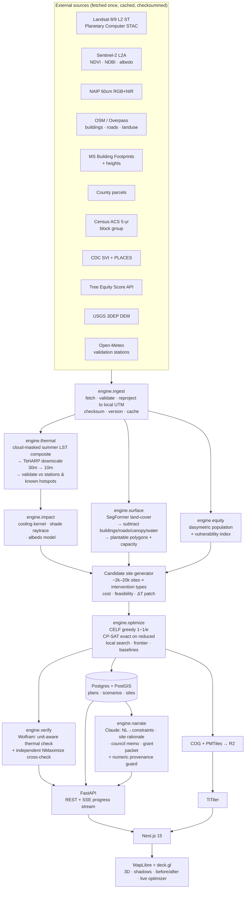

# CoolBlock — End-to-End Build Plan

> **"Everyone built the map. Nobody built the plan."**
> A block-scale heat-mitigation siting optimizer. You give it a neighborhood and a budget.
> It gives you the ranked parcels, the modeled degrees, the people cooled, and the memo you
> take to city council.

| | |
|---|---|
| **Codename** | CoolBlock |
| **Source strategy** | [`outputs/nextstep-2026-strategy-brief.md`](outputs/nextstep-2026-strategy-brief.md) — Phase 4 ①, Phase 5 final bet |
| **Event** | NextStep Hacks 2026 — "Earth Forward" |
| **Hard deadline** | Sep 13, 2026 @ 5:00pm EDT |
| **Plan written** | Sep 4, 2026 |
| **Build posture** | Product-grade. Not a demo. |

---

## 0. How to read this document

This plan is written as if we have months, because that is how it was asked for and because
that is the only way to design a system that does not collapse when scope meets reality. It is
organized into **16 phases**, each independently shippable, each ending in something you can
put on a screen.

Section [§12 — The Compressed Calendar](#12--the-compressed-calendar--9-days-to-sep-13) maps
those 16 phases onto the 9 days that actually remain, marking each **MUST / SHOULD / COULD**.
Read the phases for *what to build and how*. Read §12 for *what ships by Sep 13*. Phases that
do not fit before the deadline are not deleted — they are the roadmap that continues after it,
and their presence in the repo is itself a signal to judges that this is a product with a
future rather than a weekend artifact.

**Contents**

1. [Governing principles](#1--governing-principles)
2. [The product in one page](#2--the-product-in-one-page)
3. [Locked decisions](#3--locked-decisions)
4. [System architecture](#4--system-architecture)
5. [The data contract](#5--the-data-contract)
6. [The science — every algorithm, specified](#6--the-science--every-algorithm-specified)
7. [The intelligence layer — Claude & Wolfram, used deeply](#7--the-intelligence-layer--claude--wolfram-used-deeply)
8. [Design system & frontend direction](#8--design-system--frontend-direction)
9. [The showpieces — what makes the UI win](#9--the-showpieces--what-makes-the-ui-win)
10. [The 16 phases](#10--the-16-phases)
11. [Agent orchestration](#11--agent-orchestration)
12. [The compressed calendar — 9 days to Sep 13](#12--the-compressed-calendar--9-days-to-sep-13)
13. [Risk register](#13--risk-register)
14. [Quality gates & testing](#14--quality-gates--testing)
15. [Deployment & operations](#15--deployment--operations)
16. [The submission package](#16--the-submission-package)
17. [Open decisions for you](#17--open-decisions-for-you)

---

## 1 · Governing principles

These are non-negotiable. Every phase gate checks against them.

### 1.1 The No-Fake Rule

Nothing in CoolBlock is simulated for effect. Specifically banned:

- ❌ Hardcoded "results" that look computed
- ❌ Artificial `setTimeout` delays to make work feel expensive
- ❌ Lorem ipsum, placeholder charts, greeked text, stock-photo "data"
- ❌ Buttons that do nothing, nav items that go nowhere, "Coming soon" in shipped UI
- ❌ A demo path that diverges from the real path

**The one sanctioned exception — demo-mode cached artifacts.** Every external dataset for the
locked neighborhood is fetched once, versioned, checksummed, and stored. The app then reads
those artifacts instead of hitting live APIs. This is **real data, computed by the real
pipeline, frozen** — reproducibility, not fakery. It is labeled in the UI (*"Data snapshot:
Landsat 2021–2025 summer composite · cached 2026-09-05"*), and the live-fetch path stays in the
codebase and stays tested. It is also the single largest de-risking move for the demo video:
nothing in the recording can time out.

### 1.2 What "product-level" means here

A feature is not done until every row is true.

| Dimension | Demo-level | **CoolBlock standard** |
|---|---|---|
| Persistence | State dies on refresh | Plans, scenarios, annotations survive; versioned; restorable |
| Identity | None | Real auth, workspaces — a neighborhood association is a team |
| Sharing | Screenshot | Public read-only scenario link, OG image, printable |
| Errors | White screen | Typed error states with a recovery action and a support path |
| Empty | Blank | Designed empty state that teaches the next action |
| Loading | Spinner | Streamed real progress with named pipeline stages |
| Mobile | Broken | Responsive; the map instrument degrades to a legible mobile read view |
| Export | None | GeoJSON, CSV, Shapefile, PDF memo, grant packet |
| Honesty | Overclaims | Uncertainty bands, methodology page, stated limitations |
| Ops | localhost | Deployed, monitored, uptime-checked, cost-bounded |
| Tests | None | Golden-file geospatial tests, optimizer property tests, E2E |

### 1.3 Scope lock

**One neighborhood, end to end, beats five cities half-working.** The strategy brief is
emphatic and it is right: *Completion* is a scored criterion. The target is a constant in one
config file. A second city is a Phase 15 generalization proof, never a Phase 3 pivot.

### 1.4 The honesty rail

Every claim the product makes carries its epistemic status. Modeled cooling is labeled
*modeled*, with a confidence band and a link to the methodology page. If Phase 3 validation
shows the literature-derived cooling coefficients don't reproduce known hot spots at block
scale, we **downgrade the language from "predicted cooling" to "prioritization score"** across
the entire product and say so plainly in the writeup. Judges reward that; overclaiming is what
gets caught by engineers.

### 1.5 The UI is a scored criterion

Design is 1 of 6 rubric criteria. This build treats it as a first-class engineering workstream
with its own phases, its own agent, and its own quality gates — not a coat of paint applied on
day 8.

---

## 2 · The product in one page

### 2.1 Who it is for

**Primary:** the two-person city sustainability office and the neighborhood association board
that just received a $50,000 heat-mitigation grant and has no defensible way to spend it.

**Secondary:** community land trusts, school-district facilities planners, urban forestry
nonprofits, and the graduate student writing the equity analysis nobody funded.

### 2.2 The moment of friction we remove

A planning meeting. Someone asks *"so where do the trees actually go?"* Today the answer is a
guess, a squeaky-wheel request, or whichever block the loudest homeowner lives on. CoolBlock
replaces that with a ranked, costed, defensible plan in under two minutes.

### 2.3 The core loop

```
  pick a neighborhood  →  set a budget  →  state your constraints in plain English
          ↓
  CoolBlock builds the heat surface, finds every plantable square metre, models the
  cooling each intervention would deliver, weights it by who is actually vulnerable,
  and solves for the best allocation of your money
          ↓
  ranked sites on a 3D map · before/after heat surface · live shade simulation
  · degrees-per-dollar frontier · beats-the-baseline proof
          ↓
  council memo · grant packet · GIS export · shareable public link
```

### 2.4 The 45-second wow

The demo's first shot, and the first thing a judge sees:

1. The 3D neighborhood loads **already extruded and already glowing** with real thermal data.
2. The time-of-day slider is dragged — **real sun-position shadows sweep across the buildings.**
3. A budget is set: `$50,000`.
4. The optimizer runs **visibly** — sites land one at a time, the running total counting up.
5. The before/after swipe divider is dragged and the heat surface **cools in place.**

No explanation is required for any of it. That is the design brief for the entire front end.

---

## 3 · Locked decisions

### 3.1 The neighborhood — recommended: **Edison-Eastlake, Phoenix, AZ**

Locked unless you override in the first hour. Rationale:

- **Phoenix runs the only municipal Office of Heat Response and Mitigation in the US** — a real,
  named institution with a real mandate. The theme statement's *"collaborate with local
  organizations"* language is satisfied by naming them.
- **Maricopa County publishes annual heat-associated death counts** — the strongest possible
  "measurable cost" figure, from a government epidemiology unit rather than a vendor blog.
- **Phoenix's Tree and Shade Master Plan set a 25% canopy goal the city is visibly missing** — a
  documented, quantified gap that our tool addresses directly.
- **Edison-Eastlake** specifically: low canopy, high vulnerability, and a federally-funded
  transformation programme, meaning parcel data, planning documents and demographic detail are
  unusually rich and public.
- Maricopa County Assessor publishes parcels openly; Phoenix Open Data publishes street trees,
  right-of-way and land use.

**Alternates if Phoenix data blocks:** ① Baltimore, MD (excellent open data + the canonical
redlining–heat literature) ② Richmond, VA (the Hoffman et al. redlining-heat study is set here)
③ Los Angeles Westlake / Pico-Union (LA GeoHub is outstanding).

**Rule:** decided once, recorded in `config/neighborhood.toml`, never revisited.

### 3.2 Brand

| | |
|---|---|
| Name | **CoolBlock** |
| Domain | `coolblock.xyz` — the free .XYZ domain is a participation prize; claim it day 1 |
| Tagline | *Where should the next 40 trees go?* |
| Positioning | *The data has been public for ten years and the disparity hasn't moved. That's not a data problem — it's an allocation problem. So we built the allocator.* |

### 3.3 Stack — final

| Layer | Choice | Why this and not the alternative |
|---|---|---|
| Frontend | **Next.js 15 (App Router) · React 19 · TypeScript · Tailwind v4** | Server components give the marketing site its LCP; the map app is a client island |
| Map engine | **MapLibre GL JS** | No token, no billing surprise, total style control |
| Basemap | **Protomaps + PMTiles on R2** | Self-hosted, free, and *bespoke* rather than a recognizable stock basemap |
| GPU layers | **deck.gl** via `MapboxOverlay` | 3D extrusion, shadow-casting `SunLight`, 20k features at 60fps |
| Hero 3D | **react-three-fiber + drei** | Marketing page only; code-split out of the app bundle |
| Motion | **Motion (Framer) + GSAP ScrollTrigger** | Motion for component state, GSAP for the scroll narrative |
| Charts | **D3 + Visx primitives, custom** | Recharts cannot render the efficient frontier or the dasymetric histogram to standard |
| Backend | **FastAPI · Python 3.12 · Pydantic v2** | The geospatial and optimization stack is Python; do not fight it |
| Geo stack | **GeoPandas · rasterio · rioxarray · shapely 2 · pyproj · odc-stac** | Industry standard, all open |
| Segmentation | **PyTorch + SegFormer-B0**, fine-tuned on Chesapeake / OpenEarthMap | CPU-viable at tile scale; no GPU dependency at demo time |
| Optimization | **OR-Tools CP-SAT + HiGHS + custom CELF greedy** | Three methods so the approximation bound can be *proved empirically* |
| Jobs | **ARQ + Redis** | Lighter than Celery, async-native, streams progress cleanly |
| Database | **PostgreSQL 16 + PostGIS 3.4 + pgvector** | Spatial joins in the DB; pgvector for the evidence RAG |
| Raster serving | **COGs on R2 + TiTiler** | Dynamic tiling straight from Cloud-Optimized GeoTIFFs |
| LLM | **Claude API** (`claude-opus-5` for memos, `claude-sonnet-5` for interactive) | Structured output, tool use, long context; headline sponsor |
| Symbolic | **Wolfram Cloud API** | Unit-aware thermal math + independent optimizer verification |
| Auth | **Clerk** | Organizations out of the box = workspaces on day one |
| Hosting | **Vercel · Fly.io · Neon (Postgres+PostGIS) · Cloudflare R2** | All free-tier viable; target < $30/mo |

### 3.4 Repo layout

```
coolblock/
├─ apps/
│  ├─ web/                    # Next.js 15 — marketing + app
│  └─ api/                    # FastAPI — REST + SSE + job control
├─ packages/
│  ├─ ui/                     # design system: tokens, primitives, motion
│  ├─ map/                    # MapLibre + deck.gl layer library
│  └─ schema/                 # shared TS types generated from Pydantic
├─ engine/                    # the science. installable Python package.
│  ├─ ingest/                 # one module per data source
│  ├─ thermal/                # LST composite, downscaling, validation
│  ├─ surface/                # segmentation, plantable-space extraction
│  ├─ impact/                 # cooling kernel, shade model, dasymetric population
│  ├─ equity/                 # vulnerability index, EWCB
│  ├─ optimize/               # CELF, MILP, local search, frontier
│  ├─ narrate/                # Claude structured generation + provenance guard
│  └─ verify/                 # Wolfram cross-check
├─ data/
│  ├─ cache/                  # versioned, checksummed source artifacts
│  └─ derived/                # pipeline outputs (COGs, PMTiles, parquet)
├─ config/
│  └─ neighborhood.toml       # THE scope lock
├─ notebooks/                 # validation + calibration, committed with outputs
├─ docs/
│  ├─ ARCHITECTURE.md
│  ├─ METHODOLOGY.md          # the honesty rail; rendered in-app
│  └─ DATA-SOURCES.md         # every source, licence, vintage
└─ .github/workflows/
```

---

## 4 · System architecture



### 4.1 The three runtime paths

| Path | Trigger | Latency | Used by |
|---|---|---|---|
| **Cold pipeline** | New neighborhood ingested | 20–90 min | Us, once per city, offline |
| **Warm solve** | User changes budget/constraints | 2–8 s, streamed | Every user interaction |
| **Read** | Loading a saved plan or public link | < 400 ms | Sharing, the demo |

The critical insight: **the expensive geospatial work is precomputed per neighborhood.** What
the user triggers is only the optimizer over a prepared candidate set — which is fast, which is
why the live optimizer animation can be real rather than theatre.

---

## 5 · The data contract

Every source: what it gives us, how we get it, its licence, and its failure mode. All free, all
keyless or free-key, none requiring approval. **Google Earth Engine is explicitly excluded** —
it requires an approval that will not clear in the window.

| # | Source | Gives us | Access | Resolution | Risk |
|---|---|---|---|---|---|
| D1 | **Landsat 8/9 Collection 2 L2** | Surface temperature (`ST_B10`), QA mask | Microsoft Planetary Computer STAC, `pystac-client` + `planetary-computer` signing | 30 m | Low |
| D2 | **Sentinel-2 L2A** | NDVI, NDBI, NDWI, albedo proxy — the downscaling predictors | Planetary Computer STAC | 10 m | Low |
| D3 | **NAIP** | 4-band RGB+NIR aerial imagery for segmentation | Planetary Computer STAC | 0.6 m | Low |
| D4 | **OpenStreetMap / Overpass** | Buildings, roads, sidewalks, land use, existing trees, bus stops, schools, playgrounds | Overpass API, then cached to GeoParquet | Vector | Low — rate-limit, so cache immediately |
| D5 | **Microsoft Building Footprints** | Higher-quality footprints + height estimates | Open S3 / PC | Vector | Low |
| D6 | **Maricopa County Assessor parcels** | Parcel geometry, ownership class, land use code | County open-data portal (Shapefile/GeoJSON) | Vector | **Medium — city-specific. Verify hour 1.** |
| D7 | **Census ACS 5-year** | Median income, poverty rate, age <5 and 65+, tenure, vehicle access, population | `api.census.gov` (free key, instant) | Block group | Low |
| D8 | **CDC/ATSDR SVI** | Composite social vulnerability | CDC CSV download | Tract | Low |
| D9 | **CDC PLACES** | Asthma, COPD, CHD, diabetes prevalence | CDC API | Tract | Low |
| D10 | **American Forests Tree Equity Score** | Canopy %, TES score, heat disparity index | Free API | Block group | Low — **cache on day 1**, it is our one third-party dependency |
| D11 | **NLCD** | Tree canopy cover, % impervious | MRLC / Planetary Computer | 30 m | Low |
| D12 | **USGS 3DEP DEM** | Terrain for the shadow model | Planetary Computer | 1–10 m | Low |
| D13 | **Open-Meteo** | Historical hourly air temperature for validation; design-day conditions | Keyless REST | Point | Low |
| D14 | **NASA POWER** | Solar irradiance for the shade/energy model | Keyless REST | Point | Low |
| D15 | **Phoenix Open Data** | Existing street-tree inventory, ROW, planned projects | City portal | Vector | Medium — city-specific |
| D16 | **Literature corpus** | The 5 papers from the brief + city plans, chunked into pgvector for grounded citation | Manual PDF ingest | — | Low |

### 5.1 Ingest discipline — the rules that prevent the classic failure

1. **Every fetch writes to `data/cache/<source>/<version>/` with a `manifest.json`** carrying
   URL, timestamp, bbox, checksum, and licence. Nothing re-fetches silently.
2. **One canonical CRS: the local UTM zone** (Phoenix → EPSG:32612). Every ingest module ends
   with `.to_crs(TARGET_CRS)` and an assertion. WGS84 exists only at the API boundary.
3. **A CRS invariant test runs in CI** — take a known landmark's true coordinates, push them
   through every transform in the pipeline, assert < 1 m drift. *The strategy brief flags
   geospatial coordinate handling as the single place LLM-written code fails silently. This
   test is the antidote and it gets written in Phase 1, before any UI exists.*
4. **Raster alignment is explicit** — one target grid (10 m, UTM, fixed origin) defined once;
   every raster is reprojected onto it with a named resampling method. No implicit alignment,
   ever.
5. **Vintage is surfaced, not hidden.** Every layer carries its acquisition date into the UI.

---

## 6 · The science — every algorithm, specified

This section is the technical defensibility of the whole project. It is what "many different
components" and "make you go wow" in the Technology criterion actually cash out to.

### 6.1 Module A — the heat surface (`engine/thermal`)

**A1. Composite.** Pull all Landsat 8/9 L2 scenes over the bbox for June–September across the
last 5 years. Cloud/shadow-mask via `QA_PIXEL` bit flags. Convert `ST_B10` DN to Kelvin
(`×0.00341802 + 149.0`), then to °C. Take the **per-pixel median** across scenes — median, not
mean, because a single hot cloud-edge artefact destroys a mean.

**A2. Statistical downscaling — 30 m → 10 m (the technique that earns the "wow").**
Landsat thermal is 30 m; block-scale siting needs finer. We use **TsHARP/DisTrad-style
regression downscaling**, which is published, defensible methodology, not invention:

1. At 30 m, fit `LST ~ f(NDVI, NDBI, albedo, % impervious)` — a gradient-boosted regressor
   with spatial cross-validation to avoid leakage.
2. Compute the residual field at 30 m.
3. Apply the fitted model to the **10 m** Sentinel-2 predictors → a 10 m LST prediction.
4. Add the bilinearly-interpolated 30 m residual back → **mass-conserving 10 m LST.**
5. Report R², RMSE, and a per-pixel uncertainty raster. The uncertainty raster is a UI layer.

**A3. Validation — the go/no-go gate (Phase 3).** Three independent checks:
- Correlate the composite against Open-Meteo station air temperature time series.
- Confirm known asphalt/parking-lot polygons read hotter than known park polygons by a
  physically plausible margin.
- Confirm the surface reproduces hot spots the city already names in its published plans.

> **If A3 fails**, we invoke the honesty rail from §1.4 immediately: the product's language
> becomes "prioritization score" rather than "predicted cooling" throughout, and the writeup
> says exactly why. That is a *Learning* criterion win, not a loss.

### 6.2 Module B — plantable space (`engine/surface`)

The step that separates CoolBlock from every existing map. A rule layer and an ML layer,
because either alone is brittle.

**B1. Rule layer (fast, deterministic, explainable).** From NAIP NIR: compute NDVI at 0.6 m.
Subtract, in order: building footprints (+1 m buffer), road carriageways (+ lane buffer),
water, existing canopy (NDVI > τ ∧ height > 3 m from DEM/nDSM), and marked infrastructure.

**B2. ML layer (SegFormer-B0, fine-tuned).** Six-class land cover — impervious, low vegetation,
tree canopy, building, water, bare soil — on NAIP tiles, fine-tuned from Chesapeake Land Cover
weights. Tiled inference with overlap, seam-blended, vectorized with `rasterio.features.shapes`.

**B3. Fusion & candidate generation.** Intersect the rule mask and the ML mask; keep the
agreement region as high-confidence plantable, flag the disagreement region as
*needs-verification* (surfaced honestly in the UI — a product would). Then, for each plantable
polygon:

- `area_m2`, and `capacity = floor(area / spacing²)` per species class
- Ownership: public ROW / city-owned parcel / private, from the parcel join
- **Feasible intervention types**, each a distinct optimizer candidate:

| Type | Unit cost (planning estimate) | Cooling mechanism |
|---|---|---|
| Street tree (large canopy) | $400–1,200 planted + $75/yr | Shade + evapotranspiration |
| Park / lot tree cluster | $250–600 each | ET, larger aggregate |
| Shade structure / bus-stop canopy | $8,000–25,000 | Direct shade, no ET, instant |
| Cool roof coating | $3–8/m² | Albedo |
| Cool / reflective pavement | $10–25/m² | Albedo |
| Depaving → bioswale | $80–200/m² | Albedo + ET + stormwater co-benefit |

Multiple intervention types is what turns a tree-planting toy into an actual planning tool, and
it makes the optimizer's job genuinely interesting — mixed-integer, heterogeneous cost/benefit.

### 6.3 Module C — cooling impact (`engine/impact`)

For each candidate, produce a sparse **ΔT patch** — a small raster of modeled temperature
reduction, positioned in the neighborhood grid.

**C1. Canopy cooling kernel.** Magnitude anchored to the literature (npj Urban Sustainability:
up to 1.5 °C; Nature Communications: trees roughly halve UHI), modulated locally:

```
ΔT_peak = β · f_canopy_increment · g(impervious_fraction) · h(LST_anomaly) · w(wind/aspect)
ΔT(d)   = ΔT_peak · exp(−d² / 2σ²)        σ ≈ 25–40 m for a mature street tree
```

with β calibrated in Phase 4 by fitting observed LST against observed canopy across the
neighborhood — i.e. **calibrated on the target city's own data**, not imported wholesale. Every
coefficient is stored with its source and its confidence interval, and the ΔT is carried as a
distribution, not a point value.

**C2. Shade raytracing (the visual centrepiece).** For the design day (hottest historical day
from Open-Meteo), at hourly steps 09:00–18:00:

1. Solar azimuth/elevation from `pvlib`.
2. Build a height field: DEM + building heights + existing canopy + **proposed** canopy.
3. Cast shadows via GPU-style horizon-angle sweeping on the height raster.
4. Intersect shadow polygons with **pedestrian surfaces** — sidewalks, bus stops, crosswalks,
   school routes, playgrounds.
5. Output **shade-hours delivered to pedestrian space** per candidate.

This metric is the one nobody else will have, it is directly meaningful to a human ("this bus
stop goes from 0 to 4.2 shaded hours a day"), and it drives the frontend's best animation.

**C3. Albedo interventions.** Cool roof/pavement ΔT via a surface-energy-balance approximation
from the albedo change, net radiation from NASA POWER, and a local convective term. Cross-checked
in Wolfram with real units (§7.2) — because getting W/m² to °C right by hand is exactly where
this kind of model silently breaks.

### 6.4 Module D — who actually benefits (`engine/equity`)

**D1. Dasymetric population.** Block-group population is redistributed onto residential
building footprints weighted by footprint area × floor count. This turns a coarse polygon
average into a realistic point cloud of where people actually are — a recognized technique, and
one that a Director of Data & AI will immediately register as real work.

**D2. Heat Vulnerability Index (HVI).** A transparent, documented composite — no black box:

```
HVI = z(SVI) ⊕ z(% age 65+) ⊕ z(% age <5) ⊕ z(asthma+CHD prevalence)
      ⊕ z(% renter) ⊕ z(no-vehicle %) ⊕ z(1 − AC-access proxy)
```

Weights are exposed in the UI as sliders (a planner can and should argue with them), defaulting
to equal weight with a documented sensitivity analysis.

**D3. Exposure weighting.** People are not uniformly exposed. Transit riders at unshaded stops,
children on school walking routes, and outdoor workers get exposure multipliers derived from
OSM features.

**D4. The objective — Equity-Weighted Cooling Benefit.**

```
EWCB(S) = Σ_p  ΔT_S(x_p) · HVI(p) · exposure(p) · hours(p)
```

Units: **equity-weighted person-degree-hours.** Reported alongside three plain-language
translations, because the unit is technical and the audience is a city council:
*people meaningfully cooled*, *degrees at the hottest block*, and *shade-hours added to
pedestrian space*.

### 6.5 Module E — the optimizer (`engine/optimize`)

**E1. Why this is genuinely hard.** Benefits **overlap** — two trees 8 m apart do not deliver
double the cooling. So maximizing EWCB subject to a budget is **submodular maximization under a
knapsack constraint**: NP-hard, and *not* solvable by sorting sites by score. This is the
project's central technical claim and it must be stated exactly this way to engineering judges.

**E2. Three solvers, deliberately.**

| Solver | Method | Role |
|---|---|---|
| **CELF greedy** | Lazy-evaluated greedy on marginal EWCB/$ | Production. `(1 − 1/e) ≈ 0.63` guarantee. Fast enough to animate live. |
| **CP-SAT / HiGHS MILP** | Exact, on a reduced instance (~300 candidates) with piecewise-linear overlap penalties | Proves how close greedy actually gets. Run offline; the ratio is a headline number in the writeup. |
| **Local search** | Swap / 2-opt / budget-rebalance on the greedy solution | Squeezes the last 2–5%; makes the result defensible against "why not this obvious swap?" |

**E3. Constraints — all real, all user-facing.**
Budget cap · maintenance-cost cap (annual, multi-year) · minimum spend per block group (an
equity floor) · maximum sites per block (visual/political dispersion) · public-land-only mode ·
species diversity (no more than X% one genus — real arboricultural practice) · water-budget cap ·
mandatory inclusion/exclusion of specific sites (planners always have a site they must include).

**E4. The efficient frontier.** Re-solve across budgets from $5k to $500k → a benefit-vs-budget
curve with **marginal degrees per $1,000**. This is the single most persuasive artefact for the
business-strategy judge, stated in her native language: *diminishing returns, marginal cost of
outcome.*

**E5. The baselines — this is the proof the product works.** Solve the same neighborhood with:

- **Spread evenly** — equal spend per block group
- **Worst-first** — plant where it's hottest
- **Squeaky wheel** — randomized, weighted by higher-income blocks (the documented status quo)
- **TES-score-only** — rank by Tree Equity Score alone, the best existing tool
- **CoolBlock**

Then report the EWCB uplift at identical budget. **If CoolBlock does not beat TES-score-only by
a clear margin, we have not built anything and we need to know that on day 5, not day 13.** This
comparison is a dedicated screen in the product and a slide in the video.

---

## 7 · The intelligence layer — Claude & Wolfram, used deeply

The brief is explicit: Claude credits appear at all three prize tiers, Anthropic is the headline
sponsor, and almost nobody will touch the Wolfram licence every participant receives. Both are
used here as **load-bearing components**, not decoration. None of these is a chat wrapper.

### 7.1 Claude (`engine/narrate`)

| # | Use | Why it is not a wrapper |
|---|---|---|
| **L1** | **Natural language → optimizer constraints.** *"Keep it to public land, prioritize blocks near Garfield Elementary, cap maintenance at $8k/yr"* → validated JSON config → the solver | Structured output against a strict Pydantic schema, with tool calls to resolve place names against the actual OSM feature table. Round-trips into real compute. |
| **L2** | **Per-site rationale**, grounded strictly in that site's computed feature vector | Input is numbers, output is a sentence a resident understands. No retrieval of "facts" — only rendering of computed ones. |
| **L3** | **The council memo** — a formatted 2-page document: executive summary, methodology note, equity statement, site table, citations to the 5 papers via pgvector retrieval | Long-form structured generation over a large computed payload + a real RAG corpus. This is the deliverable the user actually wants. |
| **L4** | **Grant packet** — maps the plan onto USDA Urban & Community Forestry / IRA §60103 requirements and drafts the narrative sections | Product-level output. Real users apply for these grants. |
| **L5** | **The analyst agent** — an agentic tool-use loop over the local dataset. *"Which selected sites are on private land and need owner consent?"* → the model calls `query_sites()`, `spatial_join()`, `summarize()` against real PostGIS | A genuine agent with real tools over real data, not a Q&A box. |
| **L6** | **The numeric provenance guard** | See below. |

**L6 — the provenance guard, in detail.** Every number appearing in generated prose is
extracted post-generation by regex, and each must match a value present in the source payload
within tolerance. Unmatched numbers trigger a flagged regeneration; persistent failures are
surfaced to the user as *"this figure could not be verified against the model output."* Numbers
that do verify are rendered with a hover showing their provenance path
(`plan.sites[14].delta_t_peak`).

This is a small piece of engineering with an outsized effect. It converts "an LLM wrote a memo"
into "an LLM wrote a memo and the system proved every figure in it traces to a computation." It
is exactly the kind of detail an AI Core Engineer at Microsoft leans forward at, and it belongs
in the video.

**Model routing:** `claude-opus-5` for the memo and grant packet (quality, run once);
`claude-sonnet-5` for interactive constraint parsing and site rationale (latency). Prompt
caching on the methodology + literature corpus prefix. All prompts versioned in
`engine/narrate/prompts/` with an eval set — because prompts are code.

### 7.2 Wolfram (`engine/verify`)

Almost no other team will open this envelope. Three load-bearing uses:

1. **Unit-aware thermal computation.** The albedo→ΔT energy balance carried out with real units
   (`W/m²`, `K`, `J/(kg·K)`), so unit errors are impossible rather than merely unlikely. Hand-rolled
   Python will silently accept a `W/m²` where a `kW/m²` belongs; Wolfram will not.
2. **Symbolic calibration.** Solve the cooling decay curve's parameters symbolically and derive
   the closed-form sensitivity of EWCB to β — which is how we get honest uncertainty bands
   rather than hand-waved ones.
3. **Independent optimizer verification.** Run `NMaximize` on a reduced instance in a
   completely separate mathematical system and confirm it agrees with CP-SAT. **Two independent
   solvers agreeing is a real engineering practice**, and it is a memorable line in the writeup:
   *"we verified the optimizer against an independent symbolic solver, because we did not want
   to trust our own implementation."*

Plus the Wolfram geographic knowledgebase for entity resolution and sanity-checking geographic
context. Every Wolfram call is cached; the API is never on the demo path.

---

## 8 · Design system & frontend direction

### 8.1 The direction: **"Field Instrument"**

Not a dashboard. Not a SaaS template. CoolBlock should feel like a **precision scientific
instrument for civic work** — the visual language of a spectrometer readout crossed with an
architectural site plan. Dense, quiet, confident; the data is loud and the chrome is silent.

Two surfaces, one token system:

- **Marketing site** — light, editorial, generous. Warm paper ground, large serif display type,
  scroll-driven narrative, the 3D hero. Emotional.
- **The app** — dark, technical, dense. Near-black ground so the thermal ramp is the only strong
  colour on screen. Tabular numerals everywhere. Rational.

The shared token layer means they read as one product, and the tonal shift from *story* to
*instrument* as you enter the app is itself a designed moment.

### 8.2 Colour

**The thermal ramp is the product's signature and it must be scientifically defensible.**
No rainbow (perceptually non-uniform, and it misleads — this is well documented and an ML judge
will notice). We use a perceptually-uniform sequential ramp in the inferno/lajolla family,
colour-vision-deficiency safe, with a **texture/hatch fallback** for the before/after diff so the
comparison survives monochrome printing and CVD.

```
/* Ground — app */                    /* Ground — marketing */
--bg-0:  #0A0C0F   canvas             --paper-0: #FAF8F5
--bg-1:  #12151A   panel              --paper-1: #FFFFFF
--bg-2:  #1A1F26   raised             --ink-0:   #14171C

/* Thermal scale — perceptually uniform, CVD-safe */
--t-00: #0B0A1F   --t-20: #3B0F70   --t-40: #8C2981
--t-60: #DE4968   --t-80: #FE9F6D   --t-100:#FCFDBF

/* Semantic */
--cool:   #4CC9C0   cooling delivered / positive delta
--equity: #F4B860   vulnerability emphasis
--warn:   #E86A5C
--ok:     #6BCB77
```

Contrast target: **WCAG 2.2 AA minimum, AAA on body text.** Every thermal value is also
available as a number on hover and in the data table — colour is never the only encoding.

### 8.3 Typography

| Role | Face | Notes |
|---|---|---|
| Display (marketing) | **Instrument Serif** or **Fraunces** | High-contrast, editorial, memorable — signals "civic report" not "startup" |
| UI | **Inter Variable** with optical sizing | Workhorse; `font-feature-settings: "ss01","cv05","tnum"` |
| Data / numeric | **JetBrains Mono** or **Inter tabular** | **Tabular numerals are mandatory anywhere a number can change** — a ticking total that reflows is the single most common amateur tell |

Type scale on a 1.25 modular ratio, `clamp()`-fluid. Measure capped at 68ch. Line height 1.55
body, 1.1 display.

### 8.4 The motion system

Motion serves comprehension. Every animation answers *"what just changed and where did it come
from?"* Tokens, not ad-hoc values:

```
--ease-out:   cubic-bezier(0.16, 1, 0.3, 1)      /* entrances */
--ease-inout: cubic-bezier(0.65, 0, 0.35, 1)     /* transforms */
--spring-site: { stiffness: 260, damping: 26 }   /* site pins landing */

--d-fast: 120ms   --d-base: 240ms   --d-slow: 480ms   --d-story: 900ms
```

Rules: nothing animates longer than 480 ms except deliberate narrative moments · staggers cap at
40 ms × 12 items then batch · every list transition is FLIP, never a re-render flash · number
changes tick with `useSpring`, never snap · **`prefers-reduced-motion` is fully honoured** —
shadows jump rather than sweep, sites appear rather than drop, and the product remains completely
usable.

### 8.5 Layout & primitives

Command-bar-first (⌘K everywhere). A left inspector rail, a full-bleed map canvas, a right
context panel that changes with selection, and a bottom timeline/frontier strip. Panels are
resizable and their state persists. Custom-built primitives on Radix behaviour: `<Slider>` with a
tick-marked budget scale and live cost readout, `<ScrubBar>` for time-of-day, `<SwipeDivider>`
for before/after, `<SitePin>` with rank badge and hover card, `<StatTile>` with sparkline and
delta, `<StreamLog>` for the pipeline stages. Everything keyboard-operable.

### 8.6 Accessibility — non-negotiable

- Full keyboard map control: arrow-key pan, `+/−` zoom, `Tab` through ranked sites, `Enter` to
  inspect.
- **Every map layer has a table view.** A screen reader user can read the ranked plan as a
  sortable table with all the same numbers. This is not a fallback, it is a peer view — and it
  doubles as the export preview.
- Live-region announcements for optimizer progress: *"Site 14 of 40 selected. $31,200 of $50,000
  allocated."*
- Focus rings that are visible on both grounds. Target sizes ≥ 24 px.
- Tested with VoiceOver/NVDA at least once, honestly, and the result written up.

---

## 9 · The showpieces — what makes the UI win

Six set-pieces. Each is a real feature backed by real computation; each is also a shot in the
video. They are listed in priority order — if the calendar bites, cut from the bottom.

### ★1 — The living 3D neighborhood with real sun

Buildings extruded from OSM/MS heights, deck.gl `LightingEffect` with a `SunLight` positioned
from **actual solar geometry** for the selected date and time. Drag the time-of-day scrubber and
shadows sweep across the block in real time. Add trees and watch shaded pedestrian area grow.
A "shade-hours gained" counter ticks as you scrub. **This is the 45-second wow and the single
highest-leverage thing in the front end.**

### ★2 — The optimizer running live

The solve streams over SSE. Each selected site **lands** with a spring, a rank badge, and an
expanding cooling disc; the marginal-benefit sparkline extends; the budget bar fills; the running
totals tick. The user watches an NP-hard problem being greedily solved, in place, on the map. It
takes 4 seconds and it is completely real — the algorithm genuinely emits sites in that order.
A "explain this pick" affordance on any pin opens the L2 rationale.

### ★3 — The before/after heat surface

A draggable swipe divider clipping two raster layers in shader space, plus a crossfade toggle and
a *difference* mode (`ΔT` only, on the cool ramp, with hatch texture for CVD). A histogram in the
corner shows the whole neighborhood's temperature distribution shifting left as you drag. The
number that matters — *peak block temperature reduced by X °C* — sits above it in display type.

### ★4 — The efficient frontier

An interactive benefit-vs-budget curve. Drag along it and **the map re-renders to that budget's
plan instantly** (all budget levels are precomputed, so this is a lookup, not a solve). Annotated
with the knee point: *"beyond $180k, each additional $1,000 buys 74% less cooling."* This is the
chart that makes a business-strategy judge nod.

### ★5 — "We beat the alternatives"

Five strategies, same budget, same neighborhood, side by side — small-multiple maps above a bar
chart of EWCB. The status quo ("squeaky wheel") sits visibly at the bottom. One click swaps the
main map to any strategy for direct comparison. This screen is the product's argument for its own
existence.

### ★6 — The memo, written live

Click *Generate council memo*. The Claude stream renders into a real document view with proper
typography, and **every number lights up green as the provenance guard verifies it**, with a
hover showing which computation it came from. Then: download PDF, or publish to a public link.

### 9.7 The marketing site

Scroll-driven, one page, R3F hero. A stylized 3D city block that **heats up as you scroll into
the problem and cools as you scroll into the solution**, with real Phoenix figures counting up in
the margins. Then the evidence section (the five papers, cited properly), the live demo embed,
the methodology link, and a single CTA. Static-generated, LCP < 1.8 s, 3D lazily hydrated below
the fold and skipped entirely under reduced-motion or on low-end devices.

---

## 10 · The 16 phases

Each phase: **goal · workstreams · deliverables · definition of done · demo checkpoint.**
Phases 0–5 are largely sequential (the engine has real dependencies). Phases 6–11 parallelize
hard across agents. Phases 12–15 are convergence.

---

### Phase 0 — Foundations
**Goal:** a repo where every subsequent phase can start immediately and in parallel.

- Monorepo (pnpm + Turborepo for JS, uv for Python), all four workspaces scaffolded
- `config/neighborhood.toml` written — **the scope lock, first commit**
- CI: lint, typecheck, pytest, ruff, mypy, build, preview deploy on every PR
- Docker Compose: Postgres+PostGIS+pgvector, Redis, TiTiler, MinIO (local R2)
- Design tokens shipped as CSS custom properties + a Tailwind v4 theme, in `packages/ui`
- Clerk, Neon, Fly, Vercel, R2 provisioned; secrets in place; `coolblock.xyz` claimed
- `docs/ARCHITECTURE.md` skeleton and an ADR folder — decisions get recorded as they're made

**DoD:** `make dev` brings up the full stack on a clean machine. CI green. A styled "hello" page
deploys to `coolblock.xyz` from `main`.
**Checkpoint:** the domain resolves to something with our type and colour on it.

---

### Phase 1 — Data foundry
**Goal:** every byte we will ever need, cached locally, in one CRS, with tests.

- `engine/ingest/` — one module per source D1–D16, each with `fetch()`, `validate()`,
  `to_canonical_crs()`, `cache()`
- Manifest + checksum system; `make ingest` is idempotent and resumable
- **The CRS invariant test** (§5.1 rule 3) — written here, before anything downstream
- The canonical 10 m target grid, defined once
- GeoParquet for vectors, COG for rasters, all in `data/cache/`
- `docs/DATA-SOURCES.md` fully populated with licences and vintages

**DoD:** `make ingest` on a clean machine produces a byte-identical cache. CRS test green.
Every source has a smoke test asserting shape, bounds, and null rate.
**Checkpoint:** a notebook renders all 16 layers stacked over the neighborhood, aligned.

> ⚠️ **This is the phase that eats projects.** The brief flags geospatial coordinate handling as
> where LLM-generated code fails silently. Budget real hours here and do not let the frontend
> agent's progress create pressure to rush it.

---

### Phase 2 — The map, first light *(runs parallel with 1)*
**Goal:** get pixels on screen on day one so the front end never becomes an end-loaded risk.

- `packages/map`: MapLibre + deck.gl `MapboxOverlay` wrapper, Protomaps PMTiles basemap styled
  to our tokens (dark instrument style, hand-tuned)
- 3D building extrusion from cached footprints + heights
- Camera controller, view-state persistence, deep-linkable map state in the URL
- The app shell: command bar, inspector rail, context panel, layer manager
- Layer-registry architecture so every later layer is a plug-in, not a rewrite

**DoD:** the real neighborhood renders in 3D at 60 fps with our basemap and our chrome; map
state survives refresh and is shareable by URL.
**Checkpoint:** ★1 without the sun — it already looks like a product.

---

### Phase 3 — Heat engine
**Goal:** a validated 10 m temperature surface.

- Landsat composite with QA masking (§6.1 A1)
- TsHARP downscaling with spatial CV, plus the uncertainty raster (A2)
- **The A3 validation gate** — stations, known surfaces, known hot spots
- Export to COG → R2 → TiTiler; a `HeatSurfaceLayer` in `packages/map`
- `notebooks/01-thermal-validation.ipynb`, committed with outputs — this notebook is a
  submission artefact, not just a working file

**DoD:** R², RMSE and the uncertainty raster are reported. The validation verdict is recorded in
`docs/METHODOLOGY.md`. If it fails, the language downgrade from §1.4 is applied everywhere in the
same commit.
**Checkpoint:** the heat surface glowing over the 3D block. This is the first genuinely striking
image of the project and it should exist by day 3.

---

### Phase 4 — Plantable space
**Goal:** know every square metre where an intervention could physically go.

- Rule layer (B1) — deterministic, fast, fully explainable
- SegFormer-B0 fine-tune + tiled inference + seam blending (B2)
- Fusion, disagreement flagging, vectorization (B3)
- Candidate generation: sites × intervention types × costs × feasibility flags
- Parcel and ownership join; public/private classification
- `PlantableLayer` + `CandidateLayer` with the confidence distinction rendered honestly

**DoD:** N candidates in PostGIS with a full feature vector each. A manual spot-check of 30
random candidates against aerial imagery is documented, with the error rate stated.
**Checkpoint:** toggle "show plantable space" and the neighborhood lights up in the gaps.

---

### Phase 5 — Impact & equity
**Goal:** for every candidate, how much cooling, delivered to whom.

- Cooling kernel with β calibrated on the target city's own LST-vs-canopy relationship (C1)
- **Shade raytracing** across the design day; shade-hours to pedestrian surfaces (C2)
- Albedo model, unit-checked in Wolfram (C3)
- Dasymetric population redistribution (D1)
- HVI with exposed, adjustable weights + sensitivity analysis (D2, D3)
- EWCB scoring with uncertainty propagation (D4)
- `notebooks/02-cooling-calibration.ipynb`

**DoD:** every candidate carries a ΔT patch, a shade-hours figure, an EWCB with confidence
interval, and a full provenance trail. Sensitivity analysis committed.
**Checkpoint:** hover any candidate → a card showing its modeled cooling, its shade contribution,
and the number and vulnerability of people reached.

---

### Phase 6 — The optimizer
**Goal:** the actual product. The allocator.

- CELF greedy with lazy evaluation; **emits sites incrementally over a generator** — this is what
  makes ★2 possible, and it must be designed in from the start, not retrofitted
- CP-SAT / HiGHS exact solve on a reduced instance; the empirical approximation ratio measured
- Local search improvement pass
- All constraints from E3, each with an API surface and a UI control
- The efficient frontier: precompute the full budget sweep, store as an artefact
- **The five baselines (E5)** and the uplift comparison
- Wolfram `NMaximize` independent cross-check (§7.2.3)
- `notebooks/03-optimizer-benchmarks.ipynb`

**DoD:** solves in < 8 s for the full neighborhood. Greedy-vs-exact ratio measured and reported.
CoolBlock beats all four baselines on EWCB at equal budget, with the margin stated. Property
tests: benefit monotone in budget; greedy ≥ 0.63 × exact on every small instance.
**Checkpoint:** the ranked plan, printed to a terminal, and it is obviously sensible when you
look at where the sites are.

---

### Phase 7 — Backend product surface
**Goal:** turn the engine into a service.

- FastAPI: plans, scenarios, sites, constraints, exports, share links
- ARQ workers + Redis; **SSE progress streaming with named pipeline stages**
- Postgres schema: workspaces, users, plans, scenario versions, annotations, audit log
- Clerk auth + organization scoping; RBAC (owner/editor/viewer/public)
- OpenAPI → generated TypeScript types into `packages/schema` (no hand-written client types)
- Rate limiting, request tracing, structured logging, Sentry
- TiTiler config for the COG layers; PMTiles generation pipeline for vectors

**DoD:** every UI need is met by a typed, documented, tested endpoint. Two users in two orgs
cannot see each other's plans (tested). SSE reconnects cleanly on drop.
**Checkpoint:** `curl` a solve and watch the stages stream in.

---

### Phase 8 — Frontend core
**Goal:** the instrument, wired to real data.

- All layers registered: heat, plantable, candidates, selected sites, HVI choropleth,
  dasymetric population, shade, ΔT diff
- The full control surface: budget slider, constraint panel, HVI weight sliders, layer manager,
  time-of-day scrub
- Selection, inspection, comparison, and the **table view of every layer** (§8.6)
- Real loading/empty/error states for every surface; optimistic updates; offline-tolerant
- Deep links to any app state
- Responsive: the instrument collapses to a mobile read view — map, ranked list, key numbers

**DoD:** every number visible in the UI traces to an API field. Zero placeholder content. Every
state has a designed appearance. Lighthouse a11y ≥ 95.
**Checkpoint:** a full run-through, by hand, with no terminal open.

---

### Phase 9 — The showpieces
**Goal:** ship ★1–★6 from §9.

- ★1 sun/shadow simulation with the scrubber
- ★2 live streaming optimizer animation
- ★3 before/after swipe + difference mode + shifting histogram
- ★4 interactive efficient frontier with instant plan swap
- ★5 the five-strategy comparison screen
- ★6 the streaming memo with provenance highlighting

Plus the motion system audit: every transition on tokens, every list FLIP, reduced-motion path
verified end to end.

**DoD:** each showpiece runs at ≥ 55 fps on a mid-range laptop, works under reduced motion, and
has been recorded once as a clean 10-second clip (these clips become the video).
**Checkpoint:** the 45-second demo, timed, on a stopwatch.

---

### Phase 10 — Intelligence layer
**Goal:** Claude and Wolfram, integrated deeply.

- L1 NL→constraints with schema validation and the OSM resolution tools
- L2 site rationale, grounded, cached per site
- L3 council memo + the pgvector literature RAG over the five papers and the city plans
- L4 grant packet generator
- L5 the analyst agent with real PostGIS tools
- **L6 the numeric provenance guard** with UI provenance hovers
- Prompt versioning + an eval set with regression checks
- Wolfram: unit-checked thermal, symbolic sensitivity, independent optimizer verification

**DoD:** the provenance guard catches an injected wrong number in a test. The agent answers five
scripted analyst questions correctly against the real database. All prompts versioned with evals.
**Checkpoint:** generate a memo, read it end to end, and it is genuinely good enough to hand to a
city council.

---

### Phase 11 — Product depth
**Goal:** the things that separate a product from a demo.

- Scenario versioning with diff view — *"v3 vs v5: 6 sites changed, +0.2 °C, −$4,000"*
- Comments and annotations pinned to map locations
- Public share links with a designed read-only view and a generated OG image
- Exports: GeoJSON, Shapefile, CSV, PDF memo (Playwright print), the grant packet
- Onboarding: a 4-step guided first run that uses the real product, not a tour overlay
- Data-freshness indicators, the in-app methodology page, an honest limitations page
- Feedback capture; a changelog

**DoD:** a new user with no explanation reaches a generated memo unaided. A shared link opens
correctly for a logged-out visitor. Every export opens in QGIS.
**Checkpoint:** hand it to someone who has never seen it and say nothing.

---

### Phase 12 — The marketing site
**Goal:** the front door, and the emotional argument.

- R3F hero: the 3D block that heats and cools on scroll
- GSAP scroll narrative through the problem, with real Phoenix numbers counting up
- The evidence section — the five papers, cited properly and linked
- Live demo embed, methodology link, single CTA
- SEO, OG images, sitemap, structured data

**DoD:** LCP < 1.8 s, CLS < 0.05, Lighthouse ≥ 95 across the board. 3D fully skipped under
reduced-motion and on low-end devices without breaking the narrative.
**Checkpoint:** watch someone scroll it once and see whether they understand the problem by the
second screen.

---

### Phase 13 — Hardening
**Goal:** nothing breaks in front of a judge.

- E2E (Playwright): the full journey, the share flow, the export flow, the reconnect flow
- Golden-file tests for the geospatial pipeline against a fixed test neighborhood
- Error-boundary coverage on every route; a real 404 and 500
- Security: authz tests, input validation, rate limits, no secrets client-side, CSP
- Performance: bundle analysis, code-split 3D, image optimization, tile prefetch
- **Offline demo mode** — a flag that serves everything from the cached artefacts, verified with
  the network throttled to zero
- Cross-browser + the actual machine and screen the video will be recorded on

**DoD:** full E2E suite green. Demo mode works with WiFi off. No console errors or warnings
anywhere in the app.
**Checkpoint:** disconnect the internet and run the entire demo.

---

### Phase 14 — Evidence & validation
**Goal:** be able to defend every claim.

- Ground-truth comparison of the heat surface against any published city heat map
- Ablation study: what does each component contribute to the final EWCB uplift?
- The full baseline comparison, written up with numbers
- Sensitivity analysis on the HVI weights and on β
- `docs/METHODOLOGY.md` finished and rendered in-app
- **`docs/LIMITATIONS.md`** — written honestly and linked from the product footer

**DoD:** every claim in the product and the writeup has a computation or a citation behind it.
Limitations are stated before a judge can find them.
**Checkpoint:** an engineer reads the methodology page and finds nothing to object to.

---

### Phase 15 — Generalization *(stretch — after the deadline, or if genuinely ahead)*
**Goal:** prove it isn't hardcoded to one place.

Run the entire pipeline on a second city, driven only by a config change. Publish both. The
existence of city #2 answers the only serious "is this real?" question a judge can raise — but
**this is only attempted once Phases 0–14 are done**, because a half-built second city is worth
less than nothing.

---

### Phase 16 — Submission craft
**Goal:** convert the build into a win. See §16.

---

## 11 · Agent orchestration

The plan assumes parallel agents. The dependency structure permits four sustained lanes.

| Lane | Owns | Phases | Never touches |
|---|---|---|---|
| **🛰️ GEO** | Ingest, thermal, segmentation, impact | 1, 3, 4, 5 | Anything in `apps/` |
| **🧮 SOLVER** | Optimizer, equity, baselines, benchmarks, Wolfram | 5, 6, 14 | Anything in `apps/web` |
| **🎨 FRONT** | Design system, map package, app, showpieces, marketing | 0, 2, 8, 9, 12 | `engine/` |
| **🔌 PLATFORM** | API, DB, jobs, auth, deploy, CI, hardening | 0, 7, 11, 13, 15 | `engine/` internals |
| **✍️ NARRATIVE** *(intermittent)* | Claude layer, memo, docs, methodology, writeup, video | 10, 14, 16 | — |

**The contract that makes this work:** `packages/schema` is generated from Pydantic models and is
the single source of truth between lanes. FRONT builds against generated types and a fixture
server from hour one and is **never blocked** on GEO or SOLVER. GEO and SOLVER never see a React
file. Interface changes go through a schema PR that both lanes review.

**Cadence:** every lane commits daily to `main` behind feature flags. A daily integration pass
merges, runs the full suite, and records one screenshot of the app's current state — that
screenshot series becomes the video's progress montage and is itself evidence of honest,
distributed work in the commit history (which the brief flags as something judges check).

---

## 12 · The compressed calendar — 9 days to Sep 13

The phases above are the design. This is the ship plan. **MUST** = the submission fails without
it. **SHOULD** = it wins with it. **COULD** = post-deadline.

| Day | Date | Lanes running | Gate |
|---|---|---|---|
| **1** | Sep 4 | P0 all lanes · P1 GEO starts · P2 FRONT starts | Domain live · `make dev` works · neighborhood locked · CRS test written |
| **2** | Sep 5 | P1 GEO · P2 FRONT · P7 scaffolding PLATFORM | **All 16 sources cached.** 3D neighborhood on screen. |
| **3** | Sep 6 | P3 GEO · P2→P8 FRONT · P7 PLATFORM | **🚩 Heat-surface validation gate.** Honesty-rail decision made and applied. Devpost writeup begun. |
| **4** | Sep 7 | P4 GEO · P5 SOLVER · P8 FRONT · P7 PLATFORM | Plantable space extracted. Heat surface rendering in the app. |
| **5** | Sep 8 | P5 GEO+SOLVER · P6 SOLVER starts · P9 ★1 FRONT | **🚩 Baseline gate: does CoolBlock beat TES-only?** Shadow simulation working. |
| **6** | Sep 9 | P6 SOLVER · P9 ★2 ★3 FRONT · P10 NARRATIVE | End-to-end solve through the API. Live optimizer animation working. |
| **7** | Sep 10 | P9 ★4 ★5 ★6 FRONT · P10 NARRATIVE · P11 PLATFORM | **Feature freeze at 23:59.** Memo generating with provenance. |
| **8** | Sep 11 | P12 FRONT · P13 all · P14 NARRATIVE | Marketing site live. E2E green. Demo mode verified offline. |
| **9** | Sep 12 | P16 all · buffer | **Video recorded. Writeup finished. Repo README done.** |
| **10** | Sep 13 | Submit by 12:00 EDT | 5 hours of buffer before the 17:00 deadline, deliberately. |

### 12.1 MUST / SHOULD / COULD

**MUST (submission fails without):** P0, P1, P3, P4, P5, P6, P7, P8, ★1 ★2 ★3, L3 memo, P13
demo mode, P16.

**SHOULD (this is where the win is):** ★4 ★5 ★6, L1 NL-constraints, L6 provenance guard, Wolfram
verification, P12 marketing site, P14 methodology + limitations.

**COULD (post-deadline roadmap — ship the README section, not the code):** P11 collaboration
depth, L4 grant packet, L5 analyst agent, P15 second city, mobile-native view.

### 12.2 The three hard gates

Each gate is a decision point where we cut rather than push.

1. **End of Day 3 — heat surface validates?** If no → apply the honesty rail, reframe as
   prioritization scoring, continue. *Nothing is cancelled; the language changes.*
2. **End of Day 5 — do we beat the baselines?** If CoolBlock does not beat TES-score-only, the
   optimizer's objective is wrong. Spend Day 6 fixing the objective, not building UI. This gate
   protects against the worst outcome: a beautiful product that doesn't actually help.
3. **End of Day 7 — feature freeze.** Hard. Anything not working at 23:59 on Sep 10 is cut and
   moved to the roadmap section of the README. Days 8–9 are hardening and submission only. The
   brief's evidence is unambiguous that *Completion* outranks scope.

---

## 13 · Risk register

| # | Risk | P | Impact | Mitigation | Owner |
|---|---|---|---|---|---|
| R1 | **CRS/projection errors corrupt everything silently** | High | Fatal | The invariant test in Phase 1, before any downstream work. Landmark round-trip < 1 m. Manual review of every transform. | GEO |
| R2 | Cooling coefficients don't transfer to block scale | Med | High | Day-3 validation gate + the honesty rail. Calibrate β on local data rather than importing it. | GEO |
| R3 | Parcel data for Phoenix is unusable | Med | High | **Verify in hour 1.** Fall back to OSM landuse + MS footprints, or switch to Baltimore before any work is sunk. | GEO |
| R4 | Segmentation quality is poor | Med | Med | The rule layer alone is sufficient for a working product; ML is an accuracy upgrade, not a dependency. Ship rule-first. | GEO |
| R5 | Optimizer doesn't beat baselines | Low | **Fatal to the thesis** | Day-5 gate. If it fails, the objective function is wrong — fix the objective, not the UI. | SOLVER |
| R6 | Live demo fails during recording | Med | High | Demo mode from cached artefacts, verified with the network off. Record against it. | PLATFORM |
| R7 | 3D/shadow performance tanks on the recording machine | Med | Med | Test on the actual machine by Day 5. LOD fallbacks; a static-shadow mode. | FRONT |
| R8 | Scope creep kills completion | **High** | Fatal | The Day-7 freeze. The scope lock. Cut lists written in advance, not improvised. | All |
| R9 | Tree Equity Score API unavailable | Low | Med | Cached day 1 (§1.1). | GEO |
| R10 | Claude output hallucinates numbers into the memo | Med | Med | The L6 provenance guard. | NARRATIVE |
| R11 | Commit history looks like one 3-hour dump | Low | Med | Daily commits per lane from Day 1. The brief explicitly flags that judges look. | All |
| R12 | Writeup left to the last day | Med | **High** | Start Day 3. Both known 2025 winners wrote ~2,500 structured words and it is the only channel that scores *Learning*. | NARRATIVE |

---

## 14 · Quality gates & testing

| Layer | Tests |
|---|---|
| **Geospatial** | CRS invariant round-trip · golden-file outputs for a fixed test neighborhood · bounds/null-rate/shape smoke tests on every source · raster alignment assertions |
| **Science** | Downscaling R²/RMSE thresholds enforced in CI · calibration reproducibility · sensitivity analysis committed |
| **Optimizer** | Property: benefit monotone non-decreasing in budget · greedy ≥ 0.63 × exact on all small instances · every constraint provably respected in the output · determinism under a fixed seed |
| **API** | Contract tests against OpenAPI · authz isolation between orgs · SSE reconnection · rate-limit behaviour |
| **Frontend** | Component tests (Vitest + Testing Library) · visual regression on the showpieces · Playwright E2E for the full journey · a11y assertions (axe) in CI |
| **Performance** | Lighthouse CI budget on the marketing site · a frame-timing harness for the map showpieces · bundle-size budget that fails the build |
| **The human gate** | Every phase ends with a person using the thing without a terminal open |

---

## 15 · Deployment & operations

| Concern | Approach |
|---|---|
| Environments | `local` (compose) → `preview` (per-PR) → `production` |
| Web | Vercel, `main` auto-deploy, preview URL per PR |
| API + workers | Fly.io, Dockerized, 2 machines (api + worker), health checks, auto-rollback |
| Database | Neon Postgres 16 + PostGIS + pgvector; migrations via Alembic, verified in CI |
| Object storage | Cloudflare R2 — COGs, PMTiles, exports; a Worker for range requests |
| Secrets | Fly secrets + Vercel env; nothing in the repo; a `.env.example` that is accurate |
| Observability | Sentry (both runtimes) · OpenTelemetry traces on pipeline stages · structured JSON logs |
| Uptime | Better Stack checks on `/health`, the map tiles, and a canary solve; a public status page |
| Cost | Target < $30/mo. Alarms on R2 egress and Claude spend. |
| Backups | Neon PITR; the cache artefacts are reproducible from `make ingest` by design |

---

## 16 · The submission package

The build is 70% of the score. This is the other 30%, and the brief is emphatic that most teams
under-invest here.

### 16.1 The video (≤ 5 min, and the first 45 seconds decide it)

| Time | Content |
|---|---|
| 0:00–0:10 | **Cold open, no talking head.** The 3D neighborhood, thermal surface live, shadows sweeping. Title card: *"Where should the next 40 trees go?"* |
| 0:10–0:45 | The problem, over real Phoenix footage/data: heat deaths, the canopy gap, the $50,000 with no plan. One sentence: *"the data has been public for ten years and the disparity hasn't moved."* |
| 0:45–2:15 | **The product, used for real.** Budget set → constraints typed in English → optimizer runs live → sites land → before/after swipe → shade-hours counter. No slides. |
| 2:15–3:15 | The proof: the five-strategy comparison, the efficient frontier, the uplift number. |
| 3:15–4:00 | The memo generating, provenance verifying, PDF exporting. |
| 4:00–4:40 | Architecture: the pipeline diagram, the five components, the greedy-vs-exact ratio, the Wolfram cross-check. Named for the engineering judges. |
| 4:40–5:00 | Honest limitations, the roadmap, the live link. |

Recorded against demo mode, on the tested machine, with a written script. Recorded on Day 9 with
Day 10 as re-record buffer.

### 16.2 The Devpost writeup — target 2,500+ structured words

Both known 2025 winners wrote at this length, and it is **the only channel that can score
*Learning*, which is 1/6 of the rubric.** Started Day 3, not Day 10.

Structure: Inspiration (the specific meeting, the specific $50,000) · What it does · How we
built it (the five components, with the hard parts named) · **Challenges** (CRS alignment, the
downscaling validation, submodular overlap — the real ones, honestly) · **What we learned** (this
section is the *Learning* score; write it last and write it truthfully) · Accomplishments (the
baseline uplift, the greedy bound, the provenance guard) · What's next (Phases 11 and 15 —
proving there is a roadmap) · **Built during the hackathon** — the prior-work disclosure, clean,
since we started Sep 4.

### 16.3 The repo

README with a hero GIF above the fold, the architecture diagram, a one-command local setup that
actually works, the methodology summary, the limitations, and the roadmap. Honest commit history
spread across all nine days. Clean module boundaries — a professional engineer will open this.

### 16.4 The live link

Two of three 2025 winners shipped no live demo. Shipping a working one is therefore a **free
Completion differentiator** against the field. `coolblock.xyz`, up, monitored, with the demo
neighborhood loaded and a public shared plan reachable without login.

---

## 17 · Open decisions for you

Everything else is decided in this document. These four are yours, and only the first blocks
anything:

1. **Neighborhood — confirm Edison-Eastlake, Phoenix?** *(blocks Phase 1; needs answering in the
   first hour.)* The alternates are Baltimore, Richmond VA, or LA Westlake.
2. **Solo or team?** Changes the agent-lane assignment in §11 and the daily integration cadence.
3. **Is `claude-opus-5` API access + the Wolfram licence already in hand?** If Wolfram is not
   available, §7.2 drops to a stretch and the cross-check becomes a second Python solver instead
   — still honest, slightly less distinctive.
4. **Recording machine specs?** Determines the Day-5 3D performance test target and whether ★1
   ships with dynamic or baked shadows.

---

*Plan version 1.0 · Sep 4, 2026 · Derived from `outputs/nextstep-2026-strategy-brief.md`*
