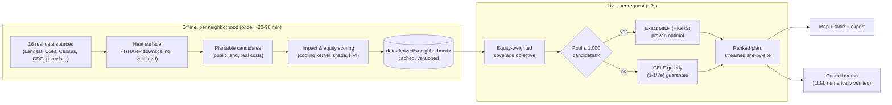

# CoolBlock

> **Everyone built the map. Nobody built the plan.**

CoolBlock is a block-scale heat-mitigation siting optimizer. Give it a
neighborhood and a budget; it gives back the ranked list of public sites to
plant trees, the modeled cooling, the people it actually reaches, and a
council-ready memo — not another heat map that ends the conversation exactly
where a city council needs it to start.

Built for NextStep Hacks 2026 ("Earth Forward"). Locked pilot neighborhood:
**Edison–Eastlake, Phoenix, AZ** — see [`config/neighborhood.toml`](config/neighborhood.toml).

**[Live demo → coolblock.vercel.app](https://coolblock.vercel.app)** — deployed on free tiers (see [`docs/DEPLOYMENT.md`](docs/DEPLOYMENT.md)); the first solve after an idle period can take 20–30 s while the servers wake.

## The problem

Extreme heat kills more people in the US every year than any other weather
hazard, and it doesn't land evenly — the same city block can run several
degrees hotter than one a mile away, and the hottest blocks are consistently
the ones with the least tree canopy, the oldest housing, and the fewest cars.
Cities increasingly *have* money for this (federal and state urban-heat
grants), real satellite heat data, and no shortage of dashboards showing them
where it's hot. What they don't have is a defensible answer to the next
question: **given $50,000 and 300 possible sites, which ones, in what order,
and why those and not the others?**

That's a budget-constrained optimization problem, not a ranking problem — two
trees eight meters apart don't deliver double the cooling, so "sort every
site by score and take the top N" (what every heat-map tool actually does)
systematically produces a worse plan than the money could buy. CoolBlock
solves the actual problem: maximize equity-weighted cooling benefit subject
to a real budget, with a real solver, not a spreadsheet sort.

## What it actually does

1. **Ingests real data** for the locked neighborhood — Landsat/Sentinel-2
   satellite imagery, OpenStreetMap, Census ACS, CDC social vulnerability,
   Maricopa County parcels — 16 sources, see [`docs/DATA-SOURCES.md`](docs/DATA-SOURCES.md).
2. **Builds a real surface-temperature model**, downscaled to 10m and
   validated against the city's own published shade plan (2 of 3 validation
   checks pass — disclosed, not hidden, see [`docs/METHODOLOGY.md`](docs/METHODOLOGY.md)).
3. **Finds every plantable site** on public land — street edges, park and
   lot margins, bus-stop shade candidates — and scores each one's real
   modeled cooling, shade delivered, and who it reaches, weighted by a real
   heat-vulnerability index (age, income, health conditions, car access).
4. **Solves the actual optimization problem**: an exact MILP (HiGHS) proves
   the *provably best* set of sites for the budget in about two seconds; a
   fast greedy fallback (CELF, submodular-maximization guarantee) handles
   pools too large to prove in time. See [`docs/adr/0028-*.md`](docs/adr/0028-the-plan-we-hand-out-is-the-proven-optimal-one.md).
5. **Shows its work**: a live map with the ranked plan, a five-strategy
   comparison against how cities actually pick sites today, GeoJSON/CSV
   export, share links, and an LLM-drafted council memo where every number is
   checked against the real computed data before it's shown to you.

## Measured, not asserted

CoolBlock's default plan — trees on public land — against the best
alternative status quo (ranking sites by Tree Equity Score, the most common
real tool), same budget, same real sites, same real objective:

| Budget | CoolBlock (EWCB) | Best alternative (EWCB) | CoolBlock's lead |
|---|---|---|---|
| $20,000 | 4,057 | 1,182 (Tree Equity Score) | **3.4×** |
| $50,000 | 11,775 | 8,182 (Tree Equity Score) | **1.4×** |
| $100,000 | 18,179 | 7,220 (Tree Equity Score) | **2.5×** |

Every plan above is **proven optimal** for its candidate pool, not just "the
best CoolBlock found" — HiGHS proves it in under two seconds at every budget
from $5,000 to $500,000. Full methodology, all five baselines, and the
honest scope limits: [`docs/METHODOLOGY.md`](docs/METHODOLOGY.md).

## How it decides



The optimizer never runs the 20–90 minute pipeline live — a request only ever
triggers the fast re-solve over an already-scored candidate set. See
[`docs/ARCHITECTURE.md`](docs/ARCHITECTURE.md) for the full system diagram.

## Tech stack

| Layer | What |
|---|---|
| **Science engine** | Python (`engine/`) — geopandas/rasterio/rioxarray, scikit-learn (TsHARP downscaling), HiGHS (`highspy`) for the exact solver |
| **API** | FastAPI, Postgres + PostGIS (plans, scenarios, sites), ARQ + Redis (job queue, SSE progress streaming) |
| **Web** | Next.js 15 (React 19), Tailwind v4, MapLibre GL + deck.gl, three.js/@react-three/fiber (the homepage scene) |
| **Shared** | TypeScript types generated from the FastAPI OpenAPI schema (`packages/schema`) — never hand-written |
| **Intelligence** | Claude (or Groq fallback) drafts the council memo; every number it states is extracted and checked against the real computed data before rendering |

## Repo layout

```
coolblock/
├─ apps/web/       Next.js — marketing homepage + the live app
├─ apps/api/       FastAPI — REST + SSE + job control
├─ packages/ui/    design system: tokens, primitives
├─ packages/map/   MapLibre + deck.gl layer library
├─ packages/schema/ shared TS types generated from the API's OpenAPI schema
├─ engine/         the science — an installable Python package
├─ data/           versioned cache + derived pipeline outputs
├─ config/         neighborhood.toml — the scope lock
├─ notebooks/      validation + calibration, committed with real outputs
└─ docs/           architecture, methodology, data sources, ADRs, deployment
```

## Quickstart (local)

Prerequisites: Node ≥ 20, pnpm ≥ 9, Python 3.11–3.12,
[`uv`](https://docs.astral.sh/uv/), Docker Desktop (or a Docker daemon).

```bash
cp .env.example .env
make dev
```

This brings up Postgres+PostGIS, Redis, MinIO (a local stand-in for
Cloudflare R2), and TiTiler via Docker Compose, installs JS and Python
dependencies, and starts the Next.js app + FastAPI dev servers.

- Web: <http://localhost:3000>
- Map: <http://localhost:3000/map> — the derived data needed to run it is
  already committed under `data/derived/edison-eastlake/`
  ([`docs/adr/0030-*.md`](docs/adr/0030-derived-data-committed-owner-names-stripped.md)); to regenerate it yourself, run
  `uv run python scripts/export_map_layers.py`, `bash scripts/build_basemap.sh`,
  and `uv run python scripts/export_heat_surface.py`
- API: <http://localhost:8000/health>
- MinIO console: <http://localhost:9001>

**No `make` on Windows?** Install it (`choco install make` or
`scoop install make`), or run the Makefile's steps directly:
`docker compose up -d --wait`, then `pnpm install && uv sync --all-packages --all-extras`,
then `bash scripts/dev.sh`.

```bash
make up          # infra only (Postgres, Redis, MinIO, TiTiler)
make install      # JS + Python deps
make lint         # ESLint + ruff
make typecheck    # tsc --noEmit + mypy
make test         # JS + Python test suites
```

Full instructions and what to click to verify each piece actually works:
[`docs/RUNNING-AND-TESTING.md`](docs/RUNNING-AND-TESTING.md).

## Deploying this yourself

A step-by-step guide to running this for real on free-tier hosting (Vercel +
Neon + Render): [`docs/DEPLOYMENT.md`](docs/DEPLOYMENT.md).

## Docs

| Doc | What's in it |
|---|---|
| [`docs/GUIDE.md`](docs/GUIDE.md) | What problem this solves, why it matters, and an honest answer to "is this actually solving it?" |
| [`docs/ARCHITECTURE.md`](docs/ARCHITECTURE.md) | System diagram, the three runtime paths, agent lanes |
| [`docs/METHODOLOGY.md`](docs/METHODOLOGY.md) | Every model, every calibration, every disclosed limitation, with real numbers |
| [`docs/DATA-SOURCES.md`](docs/DATA-SOURCES.md) | All 16 data sources, what each gives, how it's accessed |
| [`docs/DEPLOYMENT.md`](docs/DEPLOYMENT.md) | Deploying to Vercel + Neon + Render, step by step |
| [`docs/RUNNING-AND-TESTING.md`](docs/RUNNING-AND-TESTING.md) | Running it locally and verifying every feature actually works |
| [`docs/BUILD-LOG.md`](docs/BUILD-LOG.md) | The phase-by-phase engineering diary — what broke, what was found, what was fixed |
| [`docs/adr/`](docs/adr/) | One file per architecture decision, never edited after acceptance |
| [`COOLBLOCK-BUILD-PLAN.md`](COOLBLOCK-BUILD-PLAN.md) | The original full design and phase plan |

## The No-Fake Rule

Nothing in CoolBlock is simulated for effect — no hardcoded "results," no
artificial delays, no placeholder charts, no dead buttons. The one sanctioned
exception is demo-mode: cached artifacts of real data, computed by the real
pipeline, frozen for reproducibility and labeled as such.

## License

[MIT](LICENSE).
