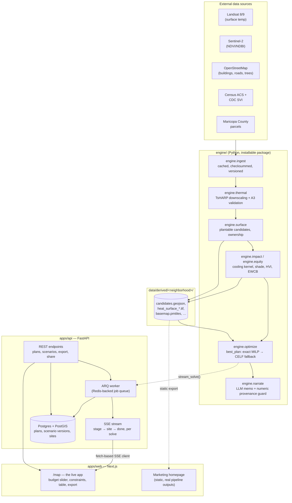
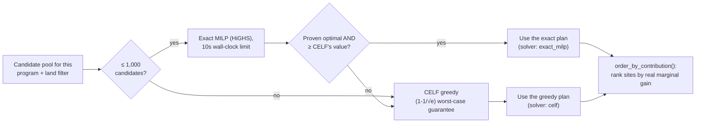

# CoolBlock — Architecture

> The living, shorter reference. [`COOLBLOCK-BUILD-PLAN.md`](../COOLBLOCK-BUILD-PLAN.md)
> is the long-form design rationale; [`docs/adr/`](adr/) is where each
> architecture-significant decision actually got made, one file per
> decision, never edited after acceptance.

## 1. The one idea that shapes everything else

The expensive work (satellite imagery, geospatial modeling, impact/equity
scoring) is **precomputed once per neighborhood, offline**. Everything a user
triggers live — dragging a budget slider, adding a constraint — is a **fast
re-solve over an already-scored candidate set**. This single design choice is
why the live optimizer's progress animation can be real (it's really
solving, in ~2 seconds) rather than a fake loading bar over a cached result.

## 2. System diagram

## 3. The three runtime paths

| Path | Trigger | Latency | What runs |
|---|---|---|---|
| **Cold pipeline** | A new neighborhood is ingested | 20–90 min, offline, run once | Every `engine.ingest`/`engine.thermal`/`engine.surface`/`engine.impact` module, in order, writing `data/derived/<neighborhood>/` |
| **Warm solve** | A user changes the budget or a constraint | ~2 s, streamed | `engine.optimize.plan_service.stream_solve()` reads the cached candidates, solves (exact MILP or CELF fallback), streams stage/site/done events over SSE |
| **Read** | Loading a saved plan or a public share link | < 400 ms | A plain Postgres read — no solve, no pipeline |

## 4. The optimizer's own decision (docs/adr/0028)

Every plan producer — the live app, the five-baseline comparison, the static
map export — goes through this one function
(`engine/optimize/best_plan.py`), so the comparison chart can never score
CoolBlock against a weaker solver than what it actually hands a user.

## 5. Two programs, never ranked together (docs/adr/0027)

`trees` (street trees + park/lot tree clusters) and `cool_roofs` are separate
candidate pools with separate objectives. A tree's *ambient* cooling (spread
over the area around it) and a cool roof's *surface* cooling (at its own
footprint) are different physical quantities — ranked in one list, cool
roofs always win, and the "tree plan" the product is named for would contain
zero trees. The default plan is trees, on public land a city can actually
plant without an owner's consent.

## 6. Agent lanes

Four lanes, one shared contract (`packages/schema`, generated from the
FastAPI OpenAPI schema — never hand-written): the science engine, the API,
the web app, and the intelligence layer (LLM memo generation + its
provenance guard). See [`COOLBLOCK-BUILD-PLAN.md`](../COOLBLOCK-BUILD-PLAN.md) §11
for the full lane/phase mapping.

## 7. Decisions

Architecture-significant decisions are recorded in [`adr/`](adr/), one file
per decision, never edited after acceptance (superseded by a new ADR
instead). Start with [`adr/0001-record-architecture-decisions.md`](adr/0001-record-architecture-decisions.md).
