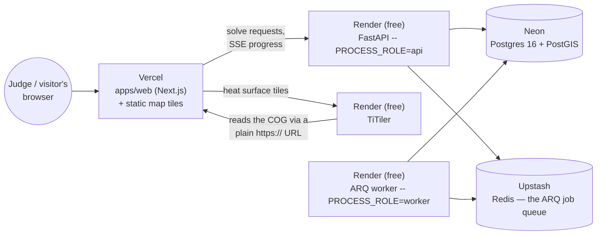

# Deploying CoolBlock for real, on free tiers

This deploys the actual app — not a simplified stand-in — across five free
services. It takes about 30–45 minutes the first time. Do the steps in
order; several later steps need a URL a previous step produces.

## The shape of it



Why five services and not one: the app genuinely has five different
concerns (a database, a job queue, the job queue's own consumer, a
tile-rendering service, and the web app itself) — this reflects the real
architecture rather than hiding it. One simplification is folded in,
versus running this exactly like local dev:

- **The basemap tiles, glyphs, sprite, and heat-surface COG are served as
  plain static files from Vercel** (`apps/web/public/tiles/`, already
  committed), not from Cloudflare R2/MinIO. TiTiler still renders the heat
  surface's dynamic tiles, but reads the COG from that same Vercel URL over
  plain HTTPS — no S3 credentials needed anywhere in production.

**The API and the ARQ worker are two separate Render services from the
same image**, not one — `apps/api/start.sh` can run either alone
(`PROCESS_ROLE=api` / `PROCESS_ROLE=worker`) or both together
(`PROCESS_ROLE` unset). Running both together in one container was the
original design here and it does not fit Render's free 512 MB limit under
real load: measured directly, the API alone uses ~276 MB and the worker
alone ~263 MB — already ~539 MB combined at rest, before a real solve's own
peak usage, and a real deploy in that mode crash-looped every few minutes
(`docs/adr/0034-*.md`). Two services, each comfortably under the limit on
its own, is the fix — not a simplification, the two-Render-service shape
below is the one to actually use.

## Before you start

- Push this repo to GitHub first (if you haven't) — every service below
  deploys by connecting to it.
- Have ready: an Anthropic API key (or a Groq key) if you want the council
  memo feature to work in production; both are optional, everything else
  works without them.

## 1. Neon — Postgres + PostGIS

1. Create a project at [neon.tech](https://neon.tech) (free tier).
2. In the Neon SQL editor, run:
   ```sql
   CREATE EXTENSION IF NOT EXISTS postgis;
   ```
   That's the only extension this schema actually uses today
   (`ScenarioSite.geometry`). `apps/api/db/models.py` also documents
   `postgis_topology`, `vector`, `pg_trgm` as provisioned locally for
   parity/future use — try them too if you want exact local/prod parity,
   but nothing breaks today if Neon can't create one of those three.
3. Copy the connection string Neon gives you (it already includes
   `?sslmode=require`). It looks like:
   ```
   postgresql://<user>:<password>@<host>.neon.tech/<db>?sslmode=require
   ```
   You'll turn this into `DATABASE_URL` in step 3 — just change the scheme
   to `postgresql+psycopg://` (this project's declared driver; a bare
   `postgresql://` defaults to psycopg2, which isn't installed):
   ```
   postgresql+psycopg://<user>:<password>@<host>.neon.tech/<db>?sslmode=require
   ```

## 2. Upstash — Redis (the ARQ job queue)

1. Create a database at [upstash.com](https://upstash.com) (free tier,
   any region close to where you'll put Render).
2. Copy the **TLS** connection string — it starts with `rediss://` (two
   s's — TLS), not `redis://`.
3. Upstash's free tier is metered per command. An idle ARQ worker polls
   Redis on a timer, which alone can add up over a month — this project's
   `ARQ_POLL_DELAY_S` setting (default 0.5s, matching arq's own default)
   exists to turn that down. Use **5** seconds in production (set in step
   3): it means a *queued* solve can take up to 5s longer to actually
   start, which barely matters next to the ~2s the solve itself takes
   (`docs/adr/0028-*.md`), and keeps well inside the free monthly quota.
   Raise it further if Upstash's dashboard shows you approaching the limit;
   lower it if you're not close and want snappier queuing.

## 3. Render — the API

1. At [render.com](https://render.com), **New → Web Service**, connect
   your GitHub repo.
2. Environment: **Docker**.
   - Dockerfile path: `apps/api/Dockerfile`
   - Docker build context directory: `.` (the repo root — required; see
     the Dockerfile's own header comment for why)
3. Instance type: **Free**.
4. Health check path: `/health`.
5. Environment variables:

   | Key | Value |
   |---|---|
   | `PROCESS_ROLE` | `api` (**required** — without this, `start.sh` runs the ARQ worker too, in the same 512 MB instance, which is what crash-looped in the first place; see `docs/adr/0034-*.md`) |
   | `DATABASE_URL` | the Neon string from step 1 (`postgresql+psycopg://…`) |
   | `REDIS_URL` | the Upstash `rediss://…` string from step 2 |
   | `ENVIRONMENT` | `staging` (**not** `production` — see "Known limitations" below for why) |
   | `CORS_ALLOW_ORIGINS` | `https://<your-project>.vercel.app` (plain, or comma-separated for more than one; a JSON array also works — you'll know this URL after step 6, Render lets you edit env vars and redeploy any time; leaving it unset for now is fine too, it falls back to allowing only localhost, not to a crash) |
   | `ANTHROPIC_API_KEY` / `GROQ_API_KEY` | optional — only needed for the council-memo feature |
   | `MEMO_LLM_PROVIDER` | `anthropic` or `groq`, matching whichever key you set |
   | `SENTRY_DSN` | optional |

   Leave `CLERK_SECRET_KEY`/`CLERK_JWKS_URL`/`CLERK_ISSUER` unset — see
   "Known limitations."
6. Deploy. First build takes a few minutes (native geospatial
   dependencies). `start.sh` runs `alembic upgrade head` automatically on
   every start, then launches the API alone.
7. Note the service's URL, e.g. `https://coolblock-api.onrender.com` —
   you'll need it in step 6.
8. Confirm it's alive: `curl https://<your-render-api>.onrender.com/health`.

## 4. Render — the ARQ worker (a second free service, same image)

This is what actually runs a solve — without it, `/plans/{id}/solve`
enqueues a job that sits at `"pending"`/`"running"` forever, since nothing
ever consumes the queue.

1. **New → Web Service**, same GitHub repo, same Dockerfile settings as
   step 3 (Docker, `apps/api/Dockerfile`, context `.`, instance **Free**).
2. **No health check path** — this service serves no HTTP traffic; leave
   Render's health check unset (or point it at nothing, if your plan
   requires a value — this service doesn't listen on `$PORT` at all in
   worker mode).
3. Environment variables: the same `DATABASE_URL`/`REDIS_URL` as step 3,
   plus:

   | Key | Value |
   |---|---|
   | `PROCESS_ROLE` | `worker` (**required**) |
   | `ARQ_POLL_DELAY_S` | `5` (see step 2's own note — this is the setting it's for) |

   `CORS_ALLOW_ORIGINS`, `ANTHROPIC_API_KEY`, etc. aren't read by this
   process; harmless to leave unset here.
4. Deploy. Logs should show `Starting worker for 1 functions:
   run_plan_solve` and `redis_version=...` — no migrations, no uvicorn.
5. This service intentionally answers no HTTP requests — there's nothing
   to `curl`. Verify it by running a real solve (step 7) instead.

## 5. Render — TiTiler (a fourth free service)

This one needs no code from this repo — it's the public TiTiler image,
configured entirely by environment.

1. **New → Web Service → Deploy an existing image from a registry**.
2. Image: `ghcr.io/developmentseed/titiler:latest`.
3. Instance type: **Free**.
4. Docker command (override): `uvicorn titiler.application.main:app --host 0.0.0.0 --port $PORT`
5. Environment variables:

   | Key | Value |
   |---|---|
   | `GDAL_DISABLE_READDIR_ON_OPEN` | `EMPTY_DIR` |
   | `CPL_VSIL_CURL_ALLOWED_EXTENSIONS` | `.tif,.TIF,.tiff` |

   No AWS/S3 variables needed — this deployment reads the heat-surface COG
   over plain HTTPS from Vercel (step 6), not from S3-compatible storage.
6. Note this service's URL too, e.g. `https://coolblock-titiler.onrender.com`.

**Optional simplification**: skip this whole step if you don't need the
live heat-surface layer on the `/map` page right away. Every other feature
(the optimizer, the ranked plan, exports, the baseline comparison, the
homepage) works without it — you'd just leave `NEXT_PUBLIC_TITILER_URL`
unset and that one layer won't render.

## 6. Vercel — the web app

1. At [vercel.com](https://vercel.com), **Add New → Project**, import the
   same GitHub repo.
2. Root directory: `apps/web`. Framework preset: Next.js (auto-detected).
   Build/output settings: leave the defaults.
3. Environment variables (add these, then deploy once to learn your
   project's `.vercel.app` URL, then add the four `*_URL` ones that
   reference it and redeploy):

   | Key | Value |
   |---|---|
   | `NEXT_PUBLIC_API_URL` | the Render API URL from step 3 |
   | `TITILER_URL` | the Render TiTiler URL from step 5 (note: **not** `NEXT_PUBLIC_TITILER_URL` — `next.config.ts` reads this name and re-exposes it under the `NEXT_PUBLIC_` one itself) |
   | `NEXT_PUBLIC_PMTILES_URL` | `https://<your-project>.vercel.app/tiles/basemap.pmtiles` |
   | `NEXT_PUBLIC_MAP_ASSETS_URL` | `https://<your-project>.vercel.app/tiles` |
   | `NEXT_PUBLIC_HEAT_SURFACE_COG_URL` | `https://<your-project>.vercel.app/tiles/heat_surface_lst.tif` |

   (A custom domain avoids the "deploy once to learn the URL" step and
   keeps these stable across redeploys — recommended if you have one.)
4. Deploy.
5. Go back to Render (step 3) and set `CORS_ALLOW_ORIGINS` to this exact
   Vercel URL (plain, e.g. `https://coolblock.vercel.app`), then redeploy
   that service — without this, every API call from the deployed
   frontend fails as an opaque CORS error.

## 7. Verify it for real

- Open the Vercel URL. The homepage should load with the real
  neighborhood scene.
- Open `/map`, click **Run optimizer**. You should see the real solve
  stream in (a couple of seconds) and land on a ranked plan.
- Click **Compare vs. baselines** — a five-bar chart should appear.
- If you deployed TiTiler, toggle the heat surface layer on the map.

If the optimizer never completes: check the Render API service's logs —
most likely `REDIS_URL` or `DATABASE_URL` is wrong (the app fails fast at
boot if Redis is unreachable, and at first migration if Postgres is).

## Known limitations of this deploy (disclosed, not hidden)

- **One of the five baseline strategies needs raw satellite imagery this
  deploy doesn't include.** "Compare vs. baselines" runs five strategies;
  four (CoolBlock, Tree Equity Score ranking, spread-evenly, squeaky
  wheel) only need the small, already-committed block-group-level cache
  (`docs/adr/0032-*.md`). The fifth, **worst-first**, re-samples the real
  downscaled land-surface-temperature model live, which needs the raw
  Landsat/Sentinel-2/NAIP/DEM/NLCD cache (~60 MB, not committed — the
  single largest file, NAIP's aerial imagery, is 54 MB on its own). On
  this deploy, `/baselines` returns a 500 rather than four good numbers
  and one gap, because `run_all_baselines` runs all five with no
  per-strategy isolation. Fix if you need this: commit
  `data/cache/landsat_c2_l2/`, `data/cache/sentinel2_l2a/`,
  `data/cache/naip/`, `data/cache/usgs_3dep_dem/`, and
  `data/cache/nlcd/` too (same gitignore/dockerignore/Dockerfile pattern
  as the three sources already there), and add them to the API
  Dockerfile's COPY list.

- **No real per-visitor auth.** No Clerk tenant is provisioned
  (`docs/adr/0016-*.md`) — every visitor shares one fixed dev workspace
  (`apps/web/lib/api.ts`'s `X-Dev-*` headers), the same posture as local
  dev. This is fine for a hackathon demo (nothing sensitive is stored) but
  means two visitors can see and edit the same plans. `ENVIRONMENT` must
  stay something other than `production` for this reason — the API
  refuses to boot with dev-fallback auth if `ENVIRONMENT=production`
  (`coolblock_api/auth.py`), by design, so it can't silently run
  unauthenticated in a real production posture without someone noticing.
- **Free services sleep.** Render's free tier spins a service down after
  ~15 minutes of no traffic; the first request after that takes ~30–50s to
  wake it back up (both the API and, if deployed, TiTiler). An uptime
  monitor (e.g. UptimeRobot's free tier, pinging `/health` every 10
  minutes) keeps it warm if that matters for a live judging window.
- **The Upstash poll-delay tradeoff** (step 2) adds up to 5s of queue
  latency before a solve starts. The solve itself is still ~2 seconds.
